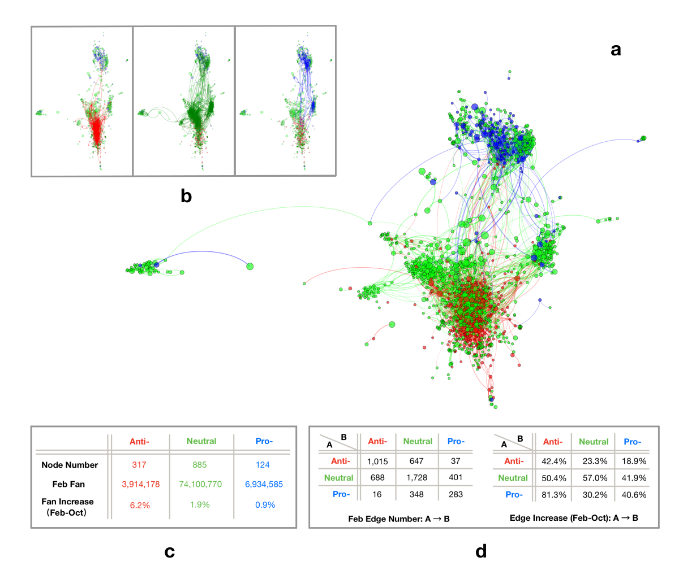

# Bow-tie Structure of Online Social Networks on Vaccination Views Competition
> MathSys 2021-22 MSc Individual Project at University of Warwick.

A network represents entities in a complex system as nodes, and their pairwise relationships as edges. Network modelling enables data analysis at a large scale, which can provide a systematic understanding of behavioral ecology in areas such as computer science, social science, biology and physics. 

In this dissertation, we investigate a network structure known as ‘bow-tie structure’ in online social networks that represent interactive web pages on Facebook. Our analysis and preliminary prediction model show that this structure can shed light on the structural differences of information diffusion in different vaccine groups, and their evolution over time.

**This github page documents the dataset and programming resources in my dissertation. Notice that we use Python as our programming language here.**

<br/>

## Dataset

>The dataset was obtained from [Johnson et al.](https://www.nature.com/articles/s41586-020-2281-1) in PDF format (328 pages), open access but requiring intensive preprocessing. To make it easier for other researchers to use this dataset, we reorganized the dataset in gpickle files (easy to be imported through [NetworkX](https://networkx.org/)) and have made them open available here.


### A. Description
It describes the snapshots of online competition between different vaccination views on February and October 2019 (pre-COVID-19), involving nearly 100 million users in Facebook from across countries, continents and languages. It can be represented by two networks corresponding to February and October. Each network is directed with self-loops but no multi-edges. The number of nodes is the same in February and October, given by 1326 in total. The number of edges in February is 5163 and in October is 7484. Details are explained as follows:

- **Node**: Each node is a public Facebook page that focuses on pro- vs anti- vaccination. It is attributed with *fan size*, that is the number of members who subscribe to the Facebook page, along with the other attribute *polarity* including anti-vaccination, pro-vaccination and neutral. Whereas its polarity remains the same for February and October snapshots, its fan size changes.

  Remarks: 1) For consistency, red, green, blue node will always represent page in anti-, neutral, pro-vaccine group. 2) It is allowed for a page to have no follower.
  
- **Edge**: A directed edge from node A to B means A recommends B to all its members at the page level. The number of times a page is recommended and the exact timestamp of the recommendation is not recorded in the dataset. Rather, an edge from A to B exists in a given monthly snapshot if page B was recommended to all the members of A at some point $t$ that is earlier or within the month of the snapshot. In that sense, the network is a cumulative representation of page recommendation over time. That is, edges that exist in February must also appear in October, but not the other way around.

  Remarks: Both 'two-way recommendation' and 'self recommendation' are allowed. Two-way recommendation means two pages recommend each other. Self recommendation means a page recommend itself to all of its followers (e.g., to increase engagement).



### B. Usage
Dataset import is required to install python package [NetworkX](https://networkx.org/).
The instruction for using this dataset is documented in [Dataset/Usage.ipynb](./Dataset/Usage.ipynb). For convenience, we briefly mention it here: 
```python
import networkx as nx

G1 = nx.read_gpickle("Reorganized_Dataset/G1.gpickle") # Feb network
G2 = nx.read_gpickle("Reorganized_Dataset/G2.gpickle") # Oct network
```

In case you would like to know the preprocessing procedure, we also document it in [Dataset/Preprocessing.ipynb](./Dataset/Preprocessing.ipynb).


<br/>

## Programming Resources

### A. Method Implementation
- **Bow-tie Detection**: https://github.com/alan-turing-institute/directedCorePeripheryPaper
- **Community Detection - Infomap**: https://github.com/mapequation/infomap
- **Newman's Directed Configuration Model**: [NetworkX](https://networkx.org/documentation/stable/reference/generated/networkx.generators.degree_seq.directed_configuration_model.html) 


### B. Network Visualization
See my [homepage](https://github.com/YuetingH) for details.

### C. Analysis Techniques
- **Sankey Diagram**:  [pySankey](https://github.com/Pierre-Sassoulas/pySankey)

<br/>

## Repository Structure
```bash
MSc_Individual_Project
¦   README.md   
¦
+---Dataset   
¦   ¦   Preprocessing.ipynb        # Data preprocessing from the original dataset
¦   ¦   Usage.ipynb                # Usage of reorganized dataset
¦   ¦
¦   +---Original_Dataset           
¦   ¦   ¦   Vaccination_data.pdf   # PDF version
¦   ¦   ¦   Vaccination_data.xlsx  # EXCEL version (converted from pdf)
¦   ¦
¦   +---Reorganized_Dataset
¦   ¦   G1.gpickle                 # February network
¦   ¦   G2.gpickle                 # October network
¦
+---Figures                       
    ¦   data.png                 
```

